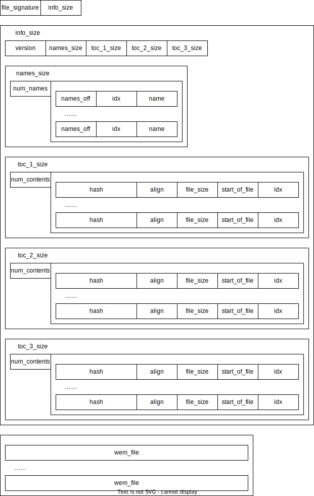
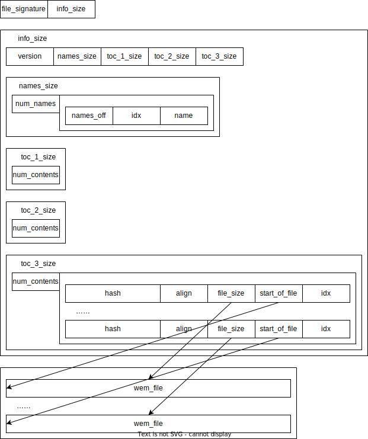

# Overview

This repo contains the information I gathered so far on modding pck files used by the anime game.

Check Issues for existing problems and possible fix.

Special thanks to

[aluigi](https://zenhax.com/viewtopic.php?t=13348) on providing a script for unpacking the target .pck files

[溯洄](https://github.com/w4123/GenshinVoice) on creating a mapping from hash code to in-game metadata

On top of their works, I come up with this project, which contains more detailed documentation and a few python scripts for unpacking, converting, substituting, AI transcribing and more.

# File Structure of PCK File

This is the structure of a general pck file, as processed by the bms script provided by aluigi (drawn by me with diagrams.net)

Each smaller block represents 4 bytes, which can be either a string or a little-endian int.

These files are parsed sequentially, so that those blocks of variable length can be read with a known size.

In genshin, they didn't used the full capacity of the file structure, but instead used a much simpler form:

The "names" sticks to a null terminated string "sfx\x00\x00".

Bytes named "align" and "idx" here were also not used, they are always the same value.

They also never used the first 2 table of content.

# License

This repo uses [CC BY-SA 4.0 license](https://creativecommons.org/licenses/by-sa/4.0/), for more details, follow the link. 